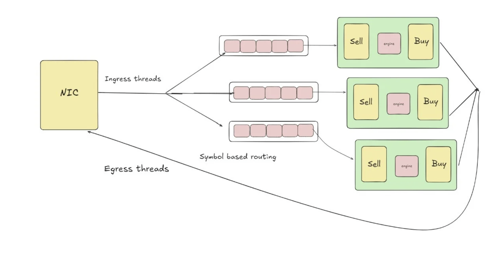
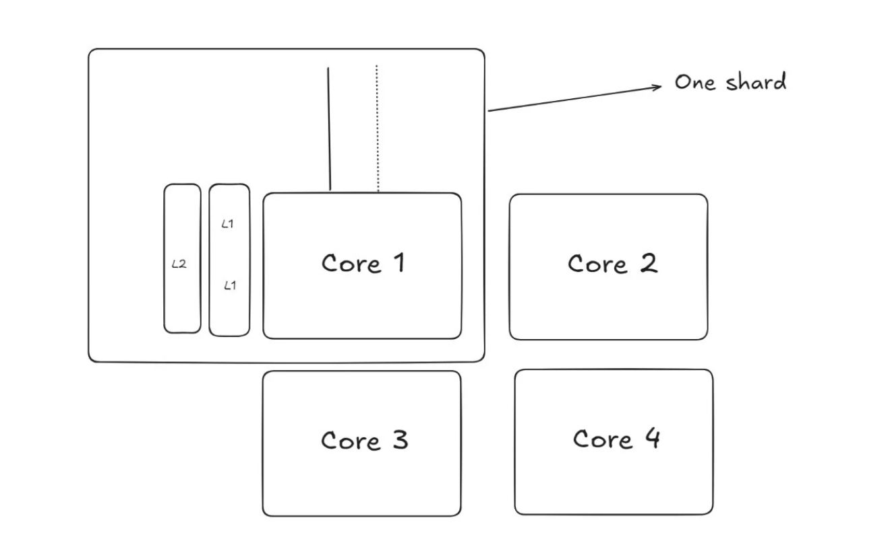
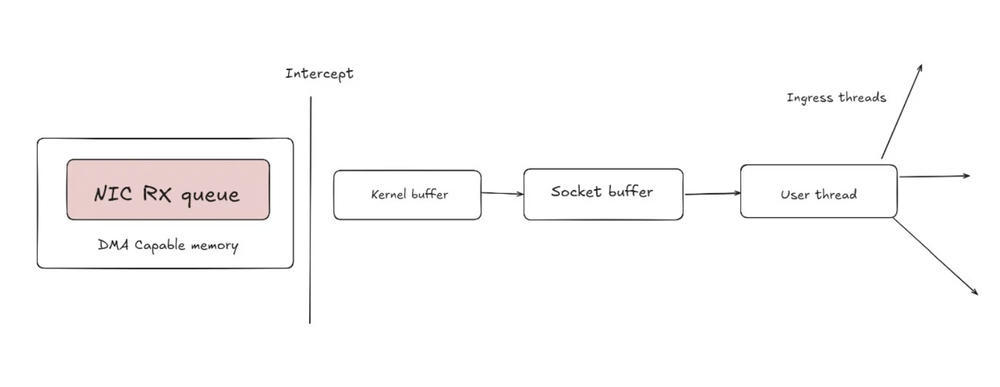
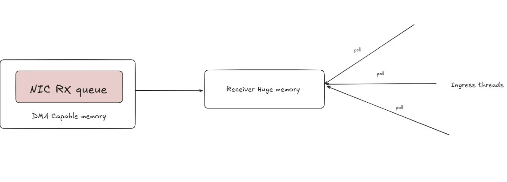

# 🚀 High-Performance Matching Engine (Rust + HPC)

This project implements an **open-source stock exchange matching engine** in **Rust**, designed with **High Performance Computing (HPC)** concepts.  
The goal is to achieve **ultra-low latency**, **parallel scalability**, and **fault-tolerance** — similar to real-world exchanges like **NASDAQ**.

---

## 📌 System Architecture

  

---

## ⚡ Core Design Principles

### 1. Lock-Free Data Structures
- **What**: Data structures (queues, stacks, order books) that avoid traditional `locks` (like mutexes).
- **Why**: Locks cause contention and slowdowns under high-frequency trading loads.
- **How it helps**:  
  - In **shared memory systems**, threads normally need locking → performance drops.  
  - With **lock-free queues**, threads can push/pop concurrently using atomic operations.  

---

### 2. Sharding the Order Book
- **What**: Splitting the order book by symbol or group of symbols.  
  Example:  
  - Shard 1 → AAPL (Apple) orders  
  - Shard 2 → TSLA (Tesla) orders
- **Why**:  
  - Each shard runs in a **single dedicated thread** → no race conditions inside the shard.  
  - Boosts parallelism (multiple symbols processed in parallel).  
- **Note**: Lock-free queues may still be needed for **cross-shard communication** (e.g., feeding from a central gateway into shards).

    

---

### 3. Thread Pinning (CPU Affinity)
- **What**: Binding a specific thread permanently to a specific CPU core.
- **Why**: Prevents thread migration by the OS scheduler, ensuring **consistent cache locality** and predictable performance.
- **Example**:  
  - AAPL shard thread → pinned to **Core 0**  
  - TSLA shard thread → pinned to **Core 1**

---

### 4. NUMA Awareness
- **What**: NUMA = **Non-Uniform Memory Access**. In multi-socket systems, each CPU socket has its own local RAM.  
- **Why it matters**:  
  - Accessing **local RAM** → fast  
  - Accessing **remote RAM** across sockets → slower  
- **Solution**:  
  - Pin threads to a socket  
  - Allocate memory (order book) in that socket’s RAM  
- **Example**:  
  - Socket 0 (Core 0–11 + 128GB RAM) → runs AAPL shard  
  - Socket 1 (Core 12–23 + 128GB RAM) → runs TSLA shard  

---

### 5. Kernel Bypassing with DPDK
- **What**: DPDK = Data Plane Development Kit.  
- **Why**: Skips the Linux kernel’s networking stack and lets user-space programs talk directly to the **network card (NIC)**.  
- **Benefit**: Drastically reduces packet processing latency — critical for order ingestion.

    
    

---

### 6. Remote Direct Memory Access (RDMA)
- **What**: Allows one machine to **read/write another’s memory directly** over the network, without CPU/OS involvement.  
- **Why**:  
  - Needed for **clustering multiple servers**.  
  - Enables ultra-fast state sharing across nodes (e.g., replicating order books for fault-tolerance).  

---

---
